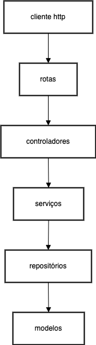

#Brain Agriculture

Projeto de desafio técnico

## Ferramentas

- NestJS
- Docker
- Postgres
- TypeORM
- Jest
- Swagger

## Diagrama de arquitetura



## Configuração do ambiente

Recomendo utilizar o Docker para rodar o projeto, mas você também pode rodar localmente.

### Rodando com Docker

```bash
$ docker compose up --build
```

Obs: Após o build inicial, utilize apenas a flag -d para subir o projeto, sem o parâmetro "--build".
exemplo: `docker compose up -d`


```bash
$ pnpm install
```

## Compilar e rodar o projeto

```bash
# development
$ pnpm run start

# watch mode
$ pnpm run start:dev

# production mode
$ pnpm run start:prod
```

## Testes

```bash
# unit tests
$ pnpm run test

# e2e tests
$ pnpm run test:e2e

# test coverage
$ pnpm run test:cov
```

## Deploy

Para realizar o deploy do projeto, utilize o Mau.

```bash
$ pnpm install -g mau
$ mau deploy
```

Agora é só acessar o link gerado pelo Mau e visualizar o projeto e a documentação da API.
